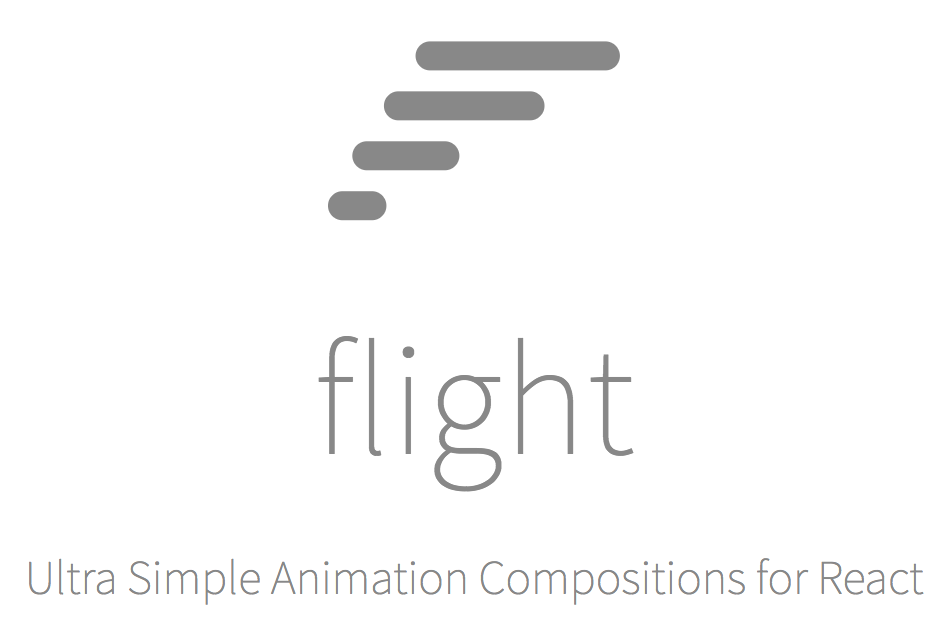

[http://react-flight.io](http://react-flight.io)

The best way to build animation compositions for React. Design and compose a
component to start with, a component to end with, and Flight will take it from
there.

## Quick Start (From Scratch)

Just clone and use the example, built around `create-react-app`:

```
$ git clone https://github.com/jondot/react-flight
$ cd react-flight
$ yarn && yarn start
```


## Quick Start (Existing Project)

With yarn (or npm):

```
$ yarn add react-flight
$ curl https://raw.githubusercontent.com/jondot/react-flight/examples/compos/src/index.js -o src/anim.js
```

And now you can frame your compositions in `anim.js`, require and place it in
any other React component.

_NOTE_: You'll have to add a jQuery-esque library (such as jQuery, jQuery-slim, Zepto,
etc). Currently that is a requirement of one of `react-flight`'s dependencies.
We plan to rebuild that dependency any way, obsoleting this requirement in the
process (also: PRs accepted!).

# Contributing

Fork, implement, add tests, pull request, get my everlasting thanks and a respectable place here :).


### Thanks:

To all [Contributors](https://github.com/jondot/foobanzle/graphs/contributors) - you make this happen, thanks!


# Copyright

Copyright (c) 2017 [Dotan Nahum](http://gplus.to/dotan) [@jondot](http://twitter.com/jondot). See [LICENSE](LICENSE.txt) for further details.
